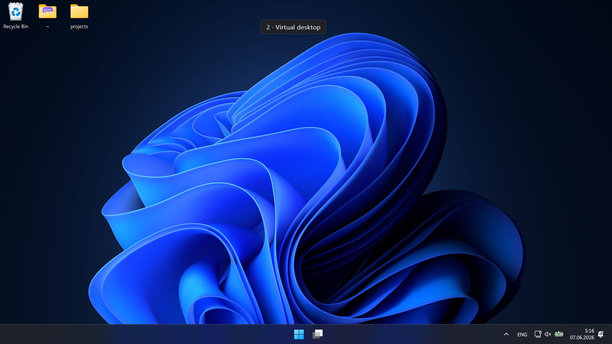
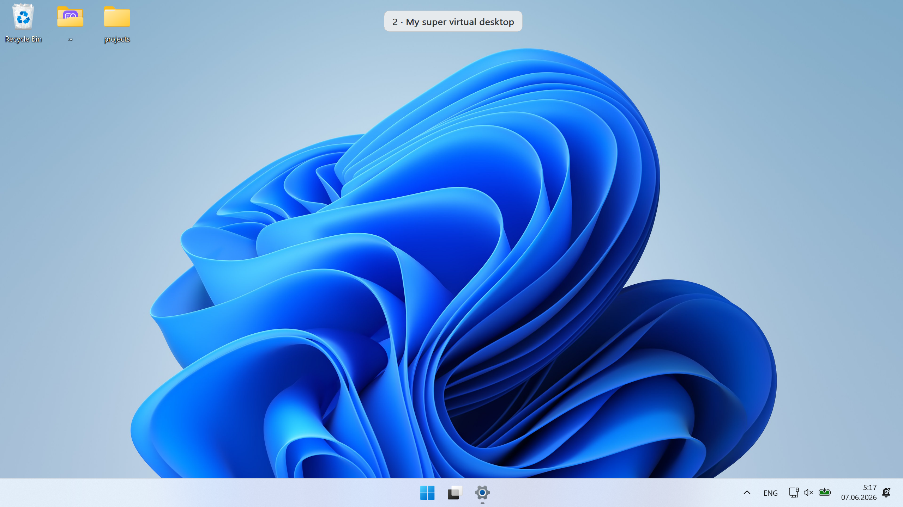
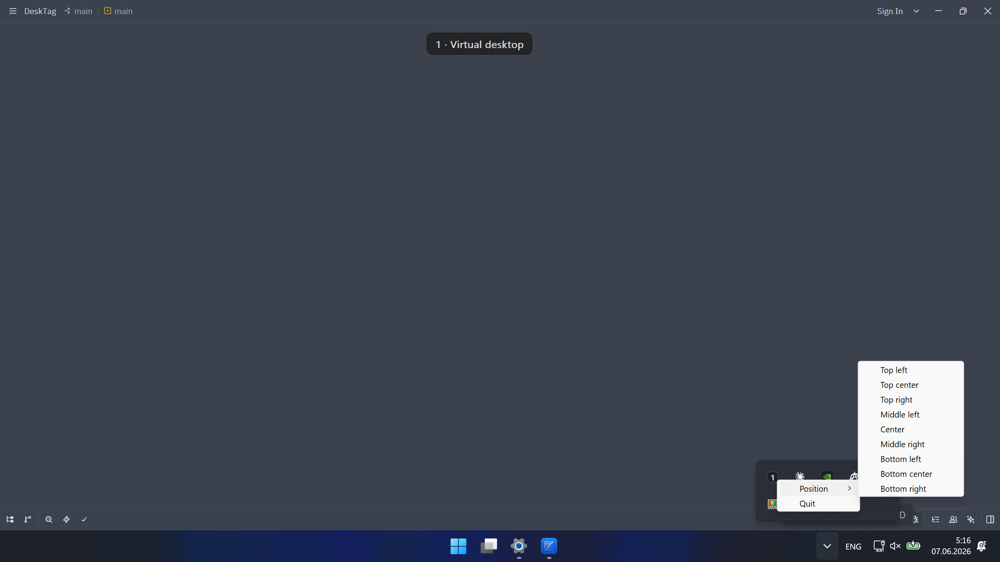
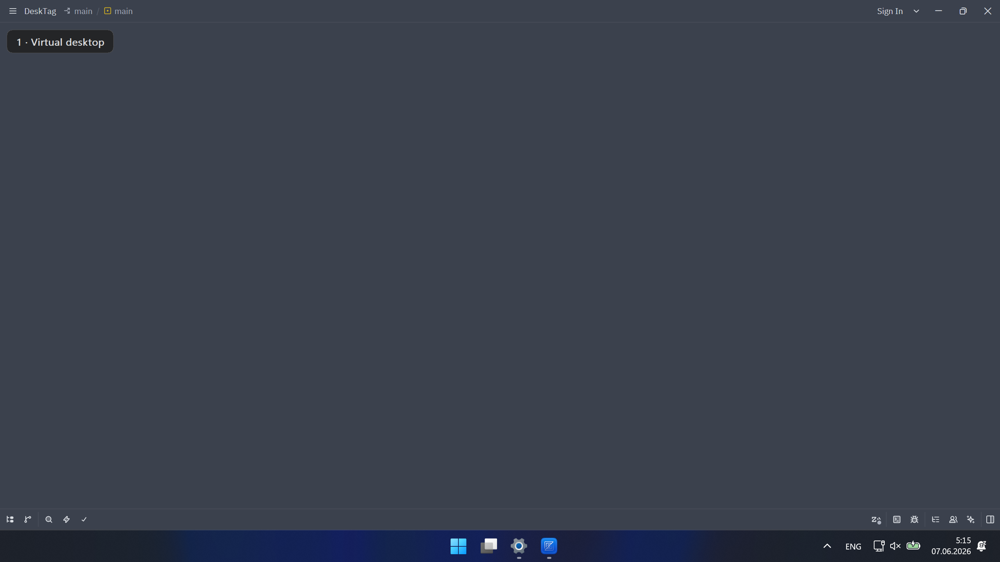
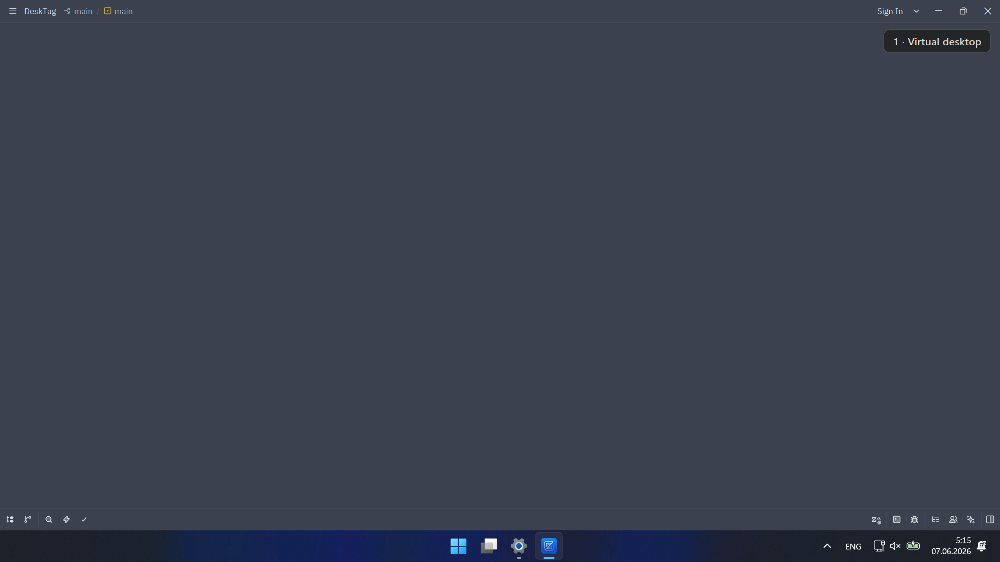
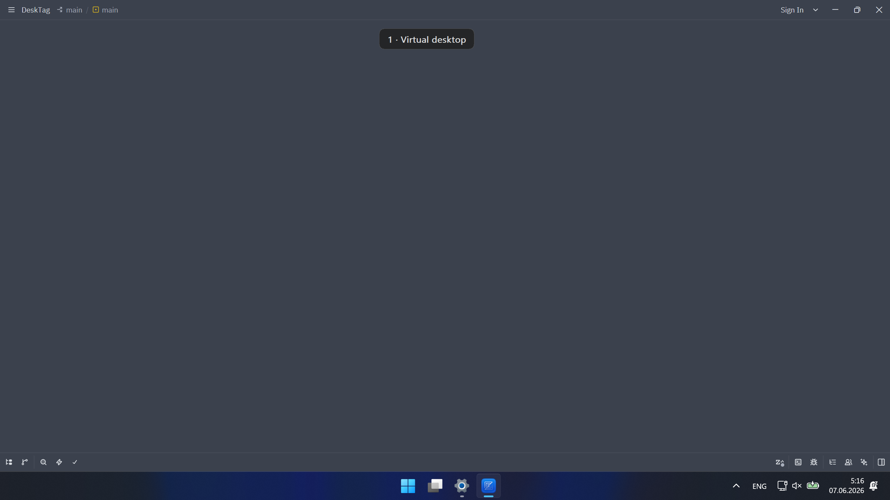

# DeskTag — always see which Windows 11 virtual desktop you're on

> An always-on-top badge that shows the name of your current Windows 11 virtual
> desktop — on every desktop, updated the moment you switch.

**Running a dozen virtual desktops and constantly losing track of which one
you're on — or what you opened it for?** Windows 11 lets you *name* virtual
desktops, but it only shows that name when you open the Win+Tab task view. The
rest of the time you're guessing, switching desktops blindly, and breaking your
flow just to check where you are.

DeskTag is a free, open-source Windows 11 utility that displays your current
virtual desktop's number and name as a small always-on-top badge, visible on
every desktop. It updates instantly when you switch desktops, and you can rename
a desktop by double-clicking the badge. Build it once, leave it running.

  

## Why DeskTag?

If you split your work across many virtual desktops — one for code, one for
email, one for meetings, one for research — you've hit the same wall:

- **Stop guessing which desktop you're on.** The current desktop number and name
  stay on screen at all times, so you always know where you are.
- **Tie each desktop to its task.** Name desktops `Work`, `Email`, `Gaming`,
  `Research` — and actually *see* that label without opening Win+Tab.
- **Cut the context-switch tax.** No more pressing Win+Tab just to remember what
  this desktop was for. One glance and you're back in flow.
- **Rename without leaving your work.** Double-click the badge to rename the
  current desktop in place.

## Features

- **Always visible.** A compact pill stays on top across every virtual desktop.
- **Live updates.** Reacts instantly when you switch desktops (Win+Ctrl+←/→).
- **Inline rename.** Double-click the badge to rename the current desktop in
  place — no Win+Tab needed.
- **Nine positions + drag.** Pick an anchor from the tray menu or drag the
  badge anywhere; the chosen spot is remembered between runs.
- **Light/dark theme.** Follows the Windows system theme automatically.
- **Live tray icon.** Mirrors the current desktop; right-click for the menu.
- **Tiny & native.** A single ~680 KB binary — pure Rust + Win32, no runtime
  dependencies.

## Windows 11 virtual desktops: built-in vs DeskTag

| Task | Windows 11 (built-in) | DeskTag |
| :--- | :--- | :--- |
| Tell which desktop you're on | Open Win+Tab to check | Always-on-top badge, always visible |
| See the desktop's **name** | Only inside Win+Tab | On every desktop, updated live |
| Rename the current desktop | Win+Tab → right-click → rename | Double-click the badge |
| Position the indicator | Not available | 9 anchor presets + drag, remembered |
| Cost | — | Free & open source (MIT) |

## Screenshots

| Dark theme | Light theme | Tray menu |
| :--------: | :---------: | :-------: |
|  |  |  |

The badge follows the Windows light/dark theme automatically. Double-click it to
rename the current desktop; right-click the tray icon to reposition it or quit.

## Positioning

Place the badge at any of nine anchor points from the tray **Position** submenu,
or drag it anywhere — the spot is remembered between runs.

| Top left | Top right | Top center |
| :------: | :-------: | :--------: |
|  |  |  |

## Install

### Download (recommended)

Grab the latest build from the
[Releases page](https://github.com/zharinov-nikita/DeskTag/releases/latest):

- **`desktag-x.y.z-x86_64.msi`** — installer; adds a Start-menu shortcut and can
  enable autostart.
- **`desktag.exe`** — portable single file; just run it.

### Build from source

Requires the stable Rust toolchain and Windows 11 (24H2, build 26100.2605+).

    cargo build --release

The binary lands at `target/release/desktag.exe`.

## Usage

- Run `desktag.exe` — the badge appears and keeps running in the background.
- **Switch desktops** — the badge follows and updates the label.
- **Double-click** the badge to rename the current desktop inline.
- **Right-click** the tray icon for the **Position** submenu and **Quit**.
- **Drag** the badge to place it anywhere on screen.
- `desktag.exe --once` — print the current desktop label and exit (handy for
  scripts).

## Autostart

The MSI installer can enable autostart during setup. For the portable `.exe`:
press Win+R, type `shell:startup`, and drop a shortcut to `desktag.exe` there.

## FAQ

**How do I see which Windows 11 virtual desktop I'm on?**
By default you have to press Win+Tab to open the task view and look. DeskTag
removes that step: it shows the current desktop's number and name in an
always-on-top badge that's visible on every desktop, all the time.

**Does Windows 11 show the current virtual desktop name on screen?**
No. Windows 11 only shows virtual desktop names inside the Win+Tab task view —
never on the desktop itself. DeskTag adds a persistent on-screen badge so the
name is always in view.

**How do I rename a Windows 11 virtual desktop?**
You can right-click a desktop in Win+Tab, or — with DeskTag running — just
double-click the badge to rename the current desktop inline, without leaving
your work.

**Can I show the desktop name on all my virtual desktops at once?**
Yes. DeskTag pins its badge to every virtual desktop automatically once it's
running, so the label is there no matter which desktop you switch to.

**Is DeskTag free?**
Yes. DeskTag is free and open source under the [MIT license](LICENSE).

**Does DeskTag work on Windows 10?**
No. DeskTag targets Windows 11 (24H2, build 26100.2605+) and relies on Windows
11 virtual-desktop interfaces.

**Will it slow down my PC?**
No. DeskTag is a single ~680 KB native binary written in Rust + Win32, with no
runtime dependencies and no background bloat.

## Requirements

- Windows 11, 24H2 (build 26100.2605) or newer.
- Rust toolchain (stable) — only for building from source.

> **Note:** DeskTag binds undocumented virtual-desktop COM interfaces that can
> shift between Windows builds. If a Windows update breaks it, please open an
> issue.

## License

[MIT](LICENSE) © Nikita Zharinov
